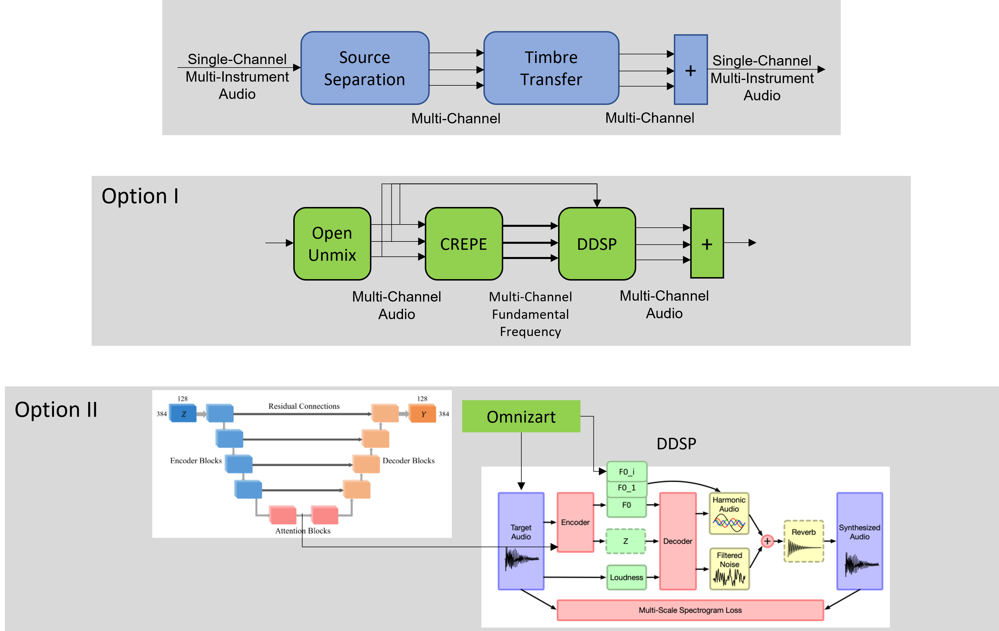

# DDSPZART - Computers and music project

## Multi-Instrument Timbre Transfer using Deep Learning

### Group: Nicolas Bähler, Olaf Dünkel, Kaan Okumuş

### Overview
We approach the task of multi-instrument timbre transfer. For this, we consider two methods: One using a common source seperator (openunmix) and a second one using a framework for multi-instrument transcription (Omnizart).

## Introduction

Our goal is to extend timbre transfer to a multi-instrument setting.
Timbre-transfer can be understood as the equivalent to style transfer between
images where one might turn a normal picture taken by a camera into a painting
by Van Gogh capturing his characteristic style. Note that only the style of the
images is altered not the content itself. Hence, in the domain of audio
timbre-transfer is the idea to change the sound of a given line of music into
another by only changing the timbre but not the melody, the rhythm etc. The
final result is the same line that seems to be played by a different instrument.

In our case, we asked ourselves if it is possible to extend this idea to
polyphonic, multi-instrument music. We explored different approaches to tackle
this challenging problem.

## Overview

### Direct approach

The easiest approach is to see a trio or a quartet like "one instrument" having
its own timbre. Replacing one member of an ensemble would ultimately change the
overall timbre. Hence, each configuration has it's own unique timbre, we'll call
this an ensemble-timbre.

Although this approach is simple and intuitive, it is problematic. Capturing
such an ensemble-timbre would by challenging because evidently the sounds are
mixed together at some points meanwhile at other moments instruments might play
solos. It would be hard for an algorithm distill a latent representation of such
an ensemble-timbre and additionally having appropriate training data would be
hard too.

### Source separation

Hence, a more practical approach is to perform source separation first, doing
timbre transfer on each single instrument and combining the resulting
timbre-transferred single instrument back into one polyphonic piece. This still
results in a ensemble-timbre transfer.

In the scope of this project we explored different frameworks to perform source
separation.

- [Spleeter](https://github.com/deezer/spleeter)
- [Open-Unmix](https://github.com/sigsep/open-unmix-pytorch)
- [Omnizart](https://github.com/Music-and-Culture-Technology-Lab/omnizart)

Next, we elaborate quickly on those different frameworks.

#### Spleeter

Spleeter has the following modes of separation:

- Vocals (singing voice) / accompaniment separation (2 stems)
- Vocals / drums / bass / other separation (4 stems)
- Vocals / drums / bass / piano / other separation (5 stems)

#### Open-Unmix

Open-Unmix tries to separate into the following classes: vocals, drums, bass and
other instruments, which is fairly similar to Spleeter capabilities (second
mode). After having analyzed both tools Spleeter and Open-Unmix and after having seen later in class too, we were more inclined to use it
Open-Unmix in our project.
It is out of scope for this project to perform a thorough network analysis, thorough training of the network, hyperparameter tuning, documentation, and evaluation of those.
However, our goal was to get the framework working (on our computer and on the IZAR cluster as well to allow faster training). We provide a notebook for easier training on the laptop and a training script for usage on the cluster.
We do not obtain perfect results but we see where show where are the restrictions and boundaries of the model and where more efforts could lead to better results. For further work, we provide functionality for evaluation as well.
We provide a rough demonstration in the notebook
`workspace_2/source_separation/1_source_separation_trumpet.ipynb`. We do not provide a
detailed explanation of the training scripts. For training, we used
`train_reduce_lr.py`, `train_clean_pipeline.ipynb` and `train_openunmix.ipynb`. Consider that for training, you need the slakh dataset.

#### Omnizart

Omnizart on the other hand is more complex and tries to cover a bigger set of
possible sources. Additionally, the instruments are quite different. Here a list
of all the instruments or sources that can handle:

- Piano
- Violin
- Cello
- Viola
- Clarinet
- Horn
- Bassoon
- Flute
- Oboe
- Contrabass
- Harpsichord

Note that Omnizart was mainly trained on classical symphonic music. In order to
be as broad as possible we opted for an exploration of Omnizart as well.

### Timbre Transfer (DDSP)

The timbre transfer itself is implemented in an very interesting framework
called [DDSP](https://github.com/magenta/ddsp). It contains several pretrained
timbres but also allows for the user to train new timbres which we did but more
on that later. The list of pretrained instrument timbre goes as follows:

- Violin
- Flute
- Flute 2
- Trumpet
- Tenor Saxophone

We demonstrate DDSP in a multi-instrument setting in the notebook "0_timbre_transfer_ensemble.ipynb" in workspace_2/source_separation with ideally separated instruments.
Here, we also use the models we trained ourselves with music that we recorded ourselves - French horn and guitar.

#### Recording our own timbres

In order to explore the training of new timbres, we recorded ourselves playing
a horn and an acoustic guitar in the silent room of the
[LCAV](https://www.epfl.ch/labs/lcav/) at EPFL.

### DDSPZART

This is our custom approach to ensemble-timbre transfer which combines both
Omnizart and DDSP.

### Data augmentation

Originally, we planned to optimize our training procedure with augmentation and to analyze the improvement. In general, more (and augmented data) should be always considered to improve the generalizability of learned model. We implemented augmentation methods in the time domain which do not change the timbre. A demonstration of these methods is given in workspace_2/processing.

## Resources

Other resources like the recordings of our own timbres are hosted on Google
Drive under this
[link](https://drive.google.com/drive/folders/1scLoQQr3HWy_r5iM6pKZ3XaHEoH_UXJq?usp=sharing).
Addtionally, we have a saved some crucial files like pretrained models there.

## How to use the repo

### Installation

Installation is automated through the different bash scripts. All of them create
virtual environments but there are some caveats.

The installations might require additional software depending on the system.
DDSP and DDSPZART both install a virtual environment having the same name. If
you want to check out both just install the DDSPZART one which naturally includes all the
dependencies of DDSP.

If you want to skip install the Google Cloud SDK the pretrained timbre for DDSP
can be found in the Google Drive folder we mentioned earlier.

### Cluster

While working on the project, we made use of the free accounts we have on the
[Scitas](https://www.epfl.ch/research/facilities/scitas/), more precisely the
[Izar](https://www.epfl.ch/research/facilities/scitas/hardware/izar/) cluster
having GPUs.

Running those frameworks on it isn't an easy task though because of all kinds of
different software dependencies. Hence, we also ran code locally which requires
way more time.

All the relevant `sbatch` submission scripts can be found in the `cluster` directory.

### Spleeter source separation

An example bash script can be found in `workspace/spleeter`.

### Omnizart source separation

The python script `workspace/omni_transcribe.py` implements the source
separation. If no arguments are given it is simply run on test data.

### DDSP timbre transfer

The python script `workspace/ddsp_timbre_transfer.py` implements the timbre
transfer. If no arguments are given it is simply run on test data.

### DDSPZART ensemble-timbre transfer

The jupyter notebook `workspace/ddspzart.ipynb` finally implements the entire
pipeline of the source separation, timbre transfer and recombining the single
tracks. It takes some time to be run hence, we include all the files of an
example run on a excerpt of a piece by Bach for a string ensemble in
`workspace/data` called `1788_example.wav`. The original file can again be found
as `1788.wav` on our Google Drive.

All those (intermediate) results can be played in the Jupyter notebook
`workspace/ddspzart_example_run_results.ipynb`.

## Conclusion

Yes we are aware of the fact that our results are not very good (but absolutely
hilarious!!!). This shows us how difficult the task still is to solve. But
nonetheless we have learnt a lot on our quest to generate some truly funny
timbre transfer results!
